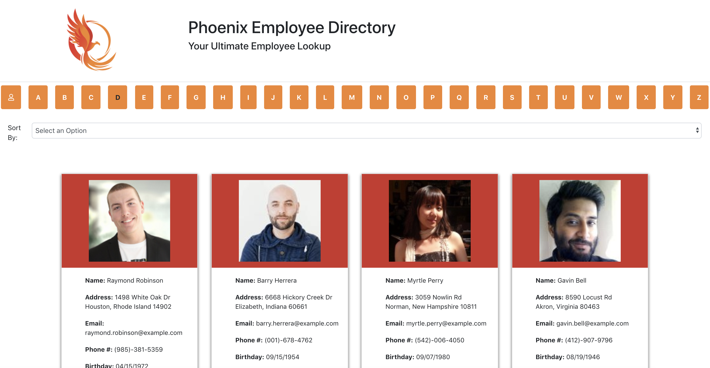

# EmployeeDirectory
An app that functions as a directory for a companies employees

## Installation

Clone folder onto your own computer by forking the repository and using the "Clone or download" button on github.

Install all npm modules using the command "npm install".

Run the server by calling "npm start" from the root folder. 

## Functionality
This webpage serves as a directory for a company's employees. When entering the page, all employees populate the screen. The user can then filter through employees by the intial of their lastname by clicking on the desired letter at the top of the page. To view all employees again, they can click on the employee icon that preceds the alphabet. User's are also able to sort the employee's in order of their last name or their first name.  

## Coding

This project was created with react.js and utilizes randomuser API to get fake employee data to populate the directory.  

## Future Improvements
I would like to improve the formating of the search bar and add additional sort by opitioons and a search field to look for specific employees. I also want to disable buttons for letters where there are no employees with that last name and visually represent this by muting the color of the letter button. 

## Meta 

Jamie Kook - kookjc6@gmail.com

Github Repo: 
[https://github.com/JamieKook/EmployeeDirectory](https://github.com/JamieKook/EmployeeDirectory)

Deployed App: 
[https://fierce-harbor-22297.herokuapp.com//](https://fierce-harbor-22297.herokuapp.com//)